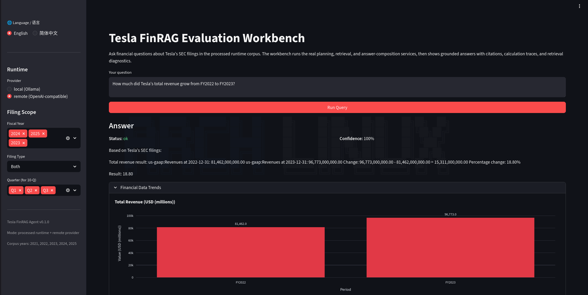

# Tesla FinRAG Agent

一个面向 Tesla 10-K / 10-Q 财报的金融问答 RAG 项目，关注跨年份检索、财务计算，以及表格与叙述信息的联合引用。

### 阅读入口

1. [docs/ARCHITECTURE.md](docs/ARCHITECTURE.md)    看系统分层、核心模块、数据流设计。
2. [docs/DELIVERY.md](docs/DELIVERY.md)   看当前交付结果、评测表现、阶段性结论。
3. [docs/DECISION.md](docs/DECISION.md)   看关键技术选型与设计取舍。

### 这个项目解决什么问题

- 面向上市公司财报问答，支持 Tesla 10-K / 10-Q 多年份语料。
- 处理跨文档问题，而不局限于单篇文档中的局部事实。
- 处理财务计算类问题，而不只生成自然语言回答。
- 结合表格数据与管理层叙述，保留答案来源。

### 项目内容

- 设计财报解析与索引链路，处理文本块、表格块和来源元数据。
- 实现混合检索能力，兼顾财务术语精确命中与语义召回。
- 构建财务问答流程，覆盖检索、计算、证据组织和答案生成。
- 建立评测与失败分析流程，用复杂问题集检查系统瓶颈。

### 在线演示
演示地址：https://finrag.wenmou.site/


- What was Tesla's total revenue in FY2023?
- Tesla 2022 Q3 的总营收是多少？
- How much did Tesla's total revenue grow from FY2022 to FY2023?
- Which was higher, Tesla's total revenue in FY2023 or FY2024?
- Tesla 2022 Q3 面临了哪些供应链挑战？

**局限性：**
- 由于服务器资源限制，仅提供remote (OpenAI-compatible) 模式的在线演示
- 由于当前输入处理策略的尚未处理完全，优先使用英文提问，以获得更好的结果。且因为Planner模块的设计，延迟较高，正在优化中。   

### 代码入口

- [src/tesla_finrag/](src/tesla_finrag/)：核心源码
- [tests/](tests/)：单元测试与集成测试
- [data/raw/](data/raw/)：原始财报数据

### 本地验证
请在.env文件中设置好环境变量（如OPENAI_API_KEY），然后运行以下命令：

```bash
git clone https://github.com/mengdehong/Tesla-FinRAG-Agent.git --depth=1
cd Tesla-FinRAG-Agent
uv sync
uv run python -m tesla_finrag ingest 
uv run streamlit run app.py
```
